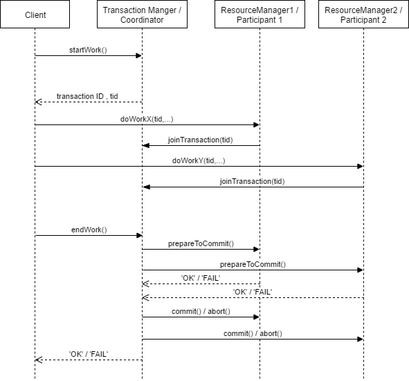

# TTK4145-Examprep

## Transaction Fundamentals
### Locking
Locking ensure that intermediate states does not propagate out of our transaction. There should not be any communication with anyone outside of the transaction.
##### Pessimistic Concurrency Control
Most transaction systems employ _pessimistic concurrency control_ where data structures and/or other resources is accessed the transaction(-participant) lock that resource to prevent others from meddling with it. Locks remain held on the resource for the duration of the transaction.
* Disadvantages
  * Deadlocks.
  * Concurrency limited by the granularity of the lock.

###### Two-Phase Locking
In order to preserve the _atomicity_ property of the transaction locks must be acquired and released in two phases. In the _growing phase_ locks may only be acquired, basically accumulating more and more locks. When all the necessary locks are acquired, the transaction enter the shrinking phase, where it may only shed the locks it already have and cannot acquire new ones.

### Two-Phase Commit
_Two-Phase commit_ is a technique to ensure atomicity of transactions, more specifically a protocol that ensure that a transaction either succeed or fail without side-effects. This ensure that the system is in a well defined state regardless of the outcome of the transaction. If the transaction fail all attempted (or actually executed) changes to the system state are rolled back to the state of the system before the transaction began. This is pretty much a classic example of _backward error-recovery_, but may not be that useful in a embedded system setting, as it often is hard/impossible to undo real-life side-effects - pretty hard to _unlaunch_ a rocket...

###### Basic algorithm
* *Prepare to commit-phase*
  1. The transaction coordinator query all participants to check if they are ready/willing/able to commit.
  1. The participants prepare to commit (more on this further down)
  1. The participants answers the query from the coordinator with either "*yes, I can commit*" or "*no, abort!*"
* *Commit-phase*
  * If **all** participants have answered *yes*
    1. Coordinator ask all participants to actually do the commit
    1. Participants do as they are told and release locks they may hold
    2. Participants sends `ack` to the coordinator when they are done.
    3. When all participants have acknowledged, the coordinator completes the transaction leaving the system in a
  * If **any** participant answers *no*
    1. The coordinator send `rollback` to all participants.
    1. All participants undo any changes it may have made, and release any locks it may hold
    2. Participants send `ack` to the coordinator indication that they have rolled back.
    3. When all participants have acknowledged that they have rolled back, the coordinator closes the transaction leaving the state unchanged.

###### Optimizations
* **Presumed abort**: the participant assume that the transaction will fail and do as little work as possible before it get confirmation from the coordinator that it should commit. If state changes are saved in incremental logs, actually writing these log-entries can wait until the transaction coordinator confirms that everyone should commit.  If the assumption of failure is correct the participant have now avoided doing work it otherwise would have to undo (delete/rollback etc), and if the assumption were wrong we still only do the work once.

* **One-Phase**: If there are only one participant in a transaction there's no need to wait for anyone. The coordinator simply ask the participant to commit right away.

* **Read-Only**: If a participant in a transaction only read stuff, it consequently does not make any state changes and does not need to bother itself with the result of the transaction and can simply ignore the _commit phase_

###### Interposition
Delegation of coordination responsibilities in a transaction is called _interposition_. Reasons for doing this include:
* Two or more resources are co-located far from the coordinator.
* Scoping - you don't want the coordinator to know about the implementation of all resources and "hide" this behind a interpositioned coordinator.

### Transaction Manager
Responsibilities:
* Create Transactions
  * Generate transactions IDs `tid`
* Keeps track of participants
* Add participants when needed
* Decide *commit/abort*.

Standard solution to avoid deadlocks is to give each transaction a deadline, and abort if it does not reach it. This is a job for the transaction manager.

### Resource Manager = "_transaction participant_"
Responsibilities:
* Holds locks for it's part of the transaction.
* Keep track of its own recovery points (if applicable)
* Participate in the _prepare-to-commit_ phase
* **Do the actual work**

### Log
Every participant (including the transaction manager) in a transaction writes a log of what it plans to change if it were to commit, but it does not actually perform the changes until it gets the `commit` instruction from the coordinator. Alternatively it may perform the changes but keep the log so that it knows how to undo the changes if it were to receive `abort` from the coordinator.

If all logs are kept it will give a full description of how the log have evolved over time, and allow for rolling back changes simply by _"playing the log backwards"_.

### Checkpoints
In order to avoid the log growing beyond bounds as time progress, **checkpoints** can be written into the log at some point in the past where the system were in a safe consistent state. Retrieving the current state is then simply taking the checkpoint and apply all later log entries. All log entries before the checkpoint is no longer needed, and can safely be deleted.

### Log Manager
A routine responsible for managing all logging in a safe manner. This allows us to queue more log entries, and optimize storage access. If slow I/O to the storage, one might also save time by handing the log entry over to the _Log Manager_ and treat the entry as logged as soon as we get an reception acknowledgement, even though the entry isn't necessarily actually written to the storage.

### Lock Manager
Manage access to lock protected resources, and keeps track of what resources participants have at any given time. This allow for the _Lock Manager_ to manage and allocate resources that may be common between more participants, and clean up locks after restarts etc. It is also possible to extend the _Lock Manager_ to include deadlock detection/prevention.

### Optimistic Concurrency Control
Locks are only acquired at the end of the transaction. Rollback if conflict is detected. Note that it may be expensive to rollback since a lot of work may potentially be lost.

### Heuristic Transactions

## Atomic Actions

#### Atomic actions and forward error recovery
* Backward error recovery enables recovery from errors, but it is difficult/impossible to undo an operation performed in the environment in which the embedded system operates.
* We must consider forward error recovery and exception handling.
* When an error occurs, every task in an atomic action must participate in the recovery.
* The exception is raised in all active tasks in the action.
* The exception is `asynchronous`, since it originated in another task.

### Asynchronous Notification
Two basic models of asynchronous notification, resumption and termination.

#### Asynchronous transfer of control

##### Why avoid asynchronous transfer of control?
* Leaves us in an undefined state.
* ATC is okay if we have full control of the changed state and a lock manager which can unlock on behalf the killed thread.

## Fault Tolerance
* If faults occur we want to continue operation, albeit at a lower capacity.
* The system should behave as specified even in the presence of bugs.
* Testing can only show the presence of bugs, not the absence.
* Testing cannot ensure a fault-free system!

## Modelling of Concurrent Programs

#### Concurrency
* Two events are `concurrent` if we cannot tell by looking at the program which will happen first. Concurrent programs are non-deterministic, which makes the hard to debug.

#### Synchronization Constraints
Requirements pertaining to the order of events.

#### Semaphores
Benefits of semaphores
* Simplify the protocols for synchronization.
* Remove the need for busy-wait loops.

__Serialization__: A must happen before B. In sequential programs we know the order of events, in concurrent programs we do not. The use of `semaphores` for signaling can guarantee that a section of code in one thread runs before a section of code in another thread. This solves the serialization problem.

To say that a thread `blocks` itself:
* Notifies the scheduler that it cannot proceed. The scheduler will thus prevent the thread from running until an event occurs in which the thread becomes unblocked.

##### Consequences of the semaphore definition
There is generally no way of knowing before a thread decrements whether it will block or not. After a thread increments the semaphore and another thread gets woken up, both continue running concurrently. __No way of knowing which, if either, will continue immediately__. Moreover, when you signal a semaphore, you don't necessarily know whether another thread is waiting, the number of unblocked threads may be zero or one.

##### Advantages of semaphores
* They impose deliberate constraints which help programmers avoid errors.
* Solutions with sempahores are often clean and organized, which makes it easy to prove correctness.

##

### Race Condition
* Two or more threads can access shared data and they both try to access it at the same time.
* You don't know the order in which the threads will try to access the data.
* Thread scheduling algorithm may switch between threads at any time.
* The result of change in data is dependent on the thread scheduling algorithm.
  * Both threads 'racing' to change the data.
* To prevent race conditions
  * Put locks around the shared data to ensure only one thread can access it at the same time.

## Exam Questions

### Synchronization primitives in Java
* __Synchronized methods__
  * Any method can be denoted `synchronized`, which means that it will run under mutual exclusion with every other synchronized method.
* `wait():` A call to wait will suspend the current thread. It will be resumed by a call to `notify()` or `notifyAll()`, or somebody calling `interrupt()` on the thread.
* `notify()` wakes an arbitrary thread blocked by this objects lock.
* `notifyAll()` wakes all threads blocked by this objects lock.

### Synchronization primitives in Ada
#### __Protected Objects__
  * A module, private variables, functions, procedues and entries.
  * __Functions__ are read-only and have no side effects. They do not change the private variables of an object. They can therefore be called concurrently by several tasks, but not concurrently with procedures and entries.
  * __Procedues__ may have side effects, hence they can make changes to the state of the object. They have to run under mutual exclusion with other tasks.
  * __Entries__ Protected by a boolean guard. Looks like a procedure call, but when the guard evaluates to false, the calling task is suspended (blocked).

### Deadlocks
* Deadlocks and race conditions can happen in a message passing system.
* **Detecting deadlocks**
  * Timeout/watchdog.
* **Handle deadlocks**
  * Break mutual exclusion
  * Preemption of resources. Aborting/restarting threads.
    * How do we preempt without leaving the system in an inconsistent state?
      * Structure the system functionality into atomic actions/transactions.

### Misc
* Transactions have only one error mode, abort. Aborting may not be an option when you have a deadline.
* Why is a system that guarantees that all deadlines are met often infeasible and/or too conservative?
  * Theoretical worst-case execution time often enormously large in part because of hardware effects.
  * Thread interaction may be so complicated that they are excluded from the scheduling proof.
