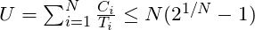
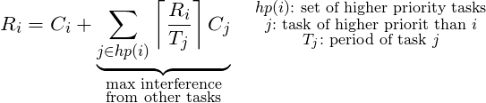
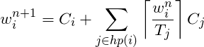
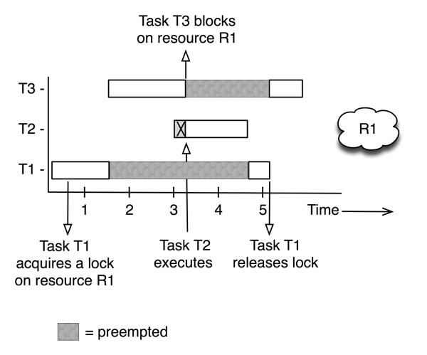

## Scheduling

In concurrent programs, it is not necessary to specify the exact ordering in which tasks execute. Synchronization primitives are employed to enforce the local ordering constraints, such as __mutual exclusion__, but the general behavior of the program exhibits significant non-determinism. If the program is correct, the output will be the same every time its run. The timing behavior will however vary considerably. Restricting the non-determinism found within concurrent systems is known as __scheduling__. A scheduling scheme provides

* An algorithm for ordering the use of system resources.
* A means of predicting the worst-case behavior of the system when the scheduling algorithm is applied.

If the predictions are decided prior to execution, the scheduling scheme is said to be __static__. If run-time decisions are employed, it is __dynamic__. A scheduling scheme involves a priority assignment algorithm and a schedulability test.

### Terminology
* **worst case execution time, WCET** ( C )
* **minimum period** ( T )
* **deadline** ( D )
* **Sufficient** : pass the test will meet deadlines
* **Necessary**: fail the test will miss deadlines
* **Exact**: necessary and sufficient
* **Sustainable**: system status schedulable if conditions "improve" (this is oddly enough not always the case)

### Simple task model
_Many of these are not very realistic_.
  * All applications are assumed to consist of a fixed set of of tasks. (No sporadic tasks. Not optimal, but can we worked around)
  * All tasks are periodic, with known periods. (Realistic in many systems)
  * The tasks are independent. (Completely unrealistic in an embedded system.)
  * All system overheads, context-switching times and so on are ignored (i.e. assumed to have zero cost). (Depends)
  * All tasks have a deadline equal to their period (that is, each task must complete before it is next released). (Inflexible, but fair enough)
  * All tasks have a fixed worst case execution time. (Not realistic to know a tight, not overly conservative estimate.)
  * Rate-monotonic priority ordering. (Our choice, so this is ok.)
  * No task contains any internal suspension points (e.g an internal delay statement or a blocking I/O operation)
  * All task execute on a single CPU

##### Example
```  
  | Thread | T (period) | D (deadline) | C    |     // This *is* schedulable.
  |--------|------------|--------------|------|
  | T1     | 1s         | 1s           | 0.5s |
  | T2     | 1s         | 1s           | 0.5s |

  | Thread | T          | D            | C    |    // This is *not* schedulable!
  |--------|------------|--------------|------|
  | T1     | 1s         | 1s           | 0.9s |
  | T2     | 1.8s       | 1.8s         | 0.1s |
  ```

### Fixed point scheduling (`FPS`)
With the _simple task model_ from above we have the following simple assignment scheme for `FPS` known as **rate monotonic priority assignment**:
> Each task is assigned an **unique** priority  based on its period. The shorter period, the higher the priority.

**Note**: _If it doesn't work with this scheme, it won't work at all!_

###### Example
```
| Task | T (period) | ==> | P (priority) |
|------|------------| ==> |--------------|
|  a   | 25         | ==> | 5            |
|  b   | 60         | ==> | 3            |
|  c   | 42         | ==> | 4            |
|  d   | 105        | ==> | 1            |
|  e   | 75         | ==> | 2            |
```

### Utilization-based analysis for FPS
If the following condition is `true` then all N tasks will meet their deadlines and we have a schedulable set of tasks:
  > 
  >
  > Assuming _the simple task model_ holds. _U_ is the total utilization of the task set.

We observe that for large _N_ the utilization will approach 69.3%, meaning that any taskset with utilization with less than 69.3% will **always** be schedulable when using _rate monotonic priority assignment_.

Drawbacks for utilization-based tests are that they are not exact and they are not applicable to a more general task model.8

### Response time analysis (RTA) for `FPS`
RTA is done in two stages. First we predict the worst-case response time (_R_) for each task. The task with highest priority will have a response time equal to its computation time
>

 The other tasks will however suffer _interference_ from tasks with higher priority, so their worst-case response time is given by
> 
<!-- R_i=C_i + \underbrace{\sum_{j\in hp(i)} \left\lceil \frac{R_i}{T_j} \right\rceil C_j}_{\substack{\text{max interference}\\ \text{from other tasks}}} \quad \substack{hp(i): \text{ set of higher priority tasks}\\ j: \text{ task of higher priorit than }i\\ T_j: \text{ period of task }j} -->

Or formulated as a recurrence:
> 
<!-- w_i^{n+1}=C_i + \mathlarger{\sum_{j\in hp(i)} \left\lceil \frac{w_i^n}{T_j} \right\rceil C_j } -->

If the worst-case response time (the solution to the last recurrence) is within the deadline then the system is schedulable.

## Priority Inversion
Lets assume we have a system consisting of three processes with different priorities, `T3` with hightest priority and `T1` with lowest, and one shared resource `R1` protected by a lock.



 `Priority inversion` is the following scenario (see figure):
 1. The scheduler see `T1` is the only one who wants to run, and thus let `T1` run.
 2. `T1` grab a hold of the lock for `R1`
 3. `T3` suddenly want to run, and having a higher priority the scheduler preempts `T1` and let `T3` run instead.
 4. `T2` want to run, but having a lower priority than `T3` it is put on hold.
 5. `T3` try to grab a hold of `R1`, but find that it's locked and blocks.
 6. The scheduler see that `T3` is blocked, and let `T2` run instead (as `T2` now is the highest priority non-blocked task that want to run).
 7. `T2` finishes, and the scheduler find that the only non-blocked task eligible for running is `T1`.
 8. `T1` gets to run, and release `R1` when it's done.
 9. The scheduler immediately see that `R1` is unlocked and let `T3` run.

 ##### So to recap what actually happened here:
 * `T2` finished first
 * `T1` finished second
 * `T3` finished last.

 **This clearly violate our predefined priority-ordering: `priority inversion`!**

 There are two variants of the priority inversion problem. **Bounded priority inversion** is simply the situation where a lower priority task gets to run because it holds a lock that a higher priority task have blocked on. This would equal the example above if you were to remove the `T2` task. The duration of the priority inversion would then be given by the time spent in the `critical section` of the low priority task. Bounded priority inversion is generally not a big deal as long as the low-priority task executes in a timely manner.

 **Unbounded priority inversion** may as the name implies last for an indefinite amount of time, and can completely starve the higher priority task, and is a far more severe situation. The example above illustrates this. If there were several intermediate priority tasks the scheduler might jump back and forth between these for any arbitrary amount of time, effectively completely killing the high priority task.

### The priority inheritance protocol
One way of solving the priority inversion problem is **priority inheritance**. Whenever a higher priority task `T1` is blocked by a resource held by a lower priority task `T3`, `T3` gets its priority bumped up to the same priority that `T1` have as long as it holds on to the resource that block `T1`. This scheme does however **not** avoid deadlocks from occurring.

**Benefits**:
* Many real-time have resources that for the most part aren't contended. When a lock isn't contended no priorities need to change, and you avoid any overhead.
**Disadvantages**:
* If there are many contended resources and/or nested resource locks priority inheritance perform worse than the ceiling priority protocols.
* You have no guarantees against deadlocks, which can be particularly dangerous if you have many nested resource dependencies.


### The original ceiling priority protocol
1. Each task is assigned a __static__ default priority.
2. Each resource has defined a __static__ ceiling value. This is the maximum priority of the tasks that use it.
3. Tasks have a __dynamic__ priority that is the maximum of its own static priority and any priority it inherits due to it blocking higher-priority tasks.
4. Tasks can only lock a resource if its dynamic priority is strictly higher than the ceiling of any __currently__ locked resource.

The effect of the protocol is that a second resource can only be locked if there does not exist a higher priority task using both resources. Consequently, the maximum amount of time a task can be blocked is equal to the worst-case execution time of the longest critical section in any of the lower-priority tasks accessed by the higher-priority tasks.

__Benefits__:
* High-priority task only blocked once by a lower-priority task.

__Disadvantages__:
* More tasks will experience this block.

### The immediate ceiling priority protocol
* Each task is assigned a __static__ default priority.
* Each resource has defined a __static__ ceiling value. This is the maximum priority of the tasks that use it.
* Tasks have a __dynamic__ priority which is the maximum of its static default priority and any it may have inherited from locking a resource.


#### Differences between OCPP and ICPP
* ICCP is easier to implement as we don't have to monitor blocking relationships.
* ICCP leads to fewer context switches as blocking is prior to first execution.
* ICCP requires more priority movements, OCCP only changes priority when an actual block occurs.

#### When either protocol is employed we achieve:
* a high-priority task can be blocked at most once during its execution by a lower priority task;
* deadlocks are avoided;
* transitive blocking is prevented;
* mutual exclusive access to resources is assured.

##### How does the priority ceiling protocol avoid deadlocks?
* We know which resource a given thread uses, and that the priority of this resource is set to max+1 of all the using threads, it is impossible for any other thread owning a given resource to be interrupted by any other thread also wanting the same resource.
