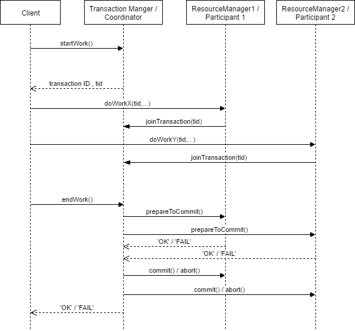
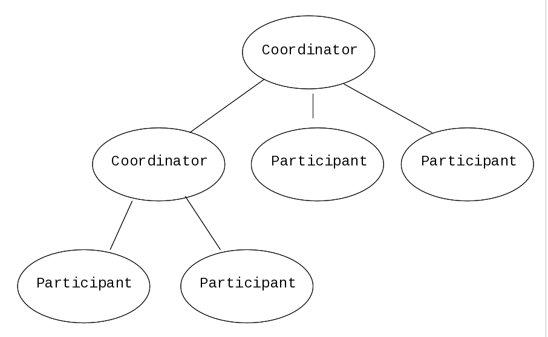

### Locking
Locking ensure that intermediate states does not propagate out of our transaction. There should not be any communication with anyone outside of the transaction.
##### Pessimistic Concurrency Control
Most transaction systems employ `pessimistic concurrency control` where data structures and/or other resources is accessed the transaction(-participant) lock that resource to prevent others from meddling with it. Locks remain held on the resource for the duration of the transaction.
* Disadvantages
  * Deadlocks.
  * Concurrency limited by the granularity of the lock.

###### Two-Phase Locking
In order to preserve the _atomicity_ property of the transaction locks must be acquired and released in two phases. In the _growing phase_ locks may only be acquired, basically accumulating more and more locks. When all the necessary locks are acquired, the transaction enter the shrinking phase, where it may only shed the locks it already have and cannot acquire new ones.

### Two-Phase Commit
`Two-Phase commit` is a technique to ensure atomicity of transactions, more specifically a protocol that ensure that a transaction either succeed or fail without side-effects. This ensure that the system is in a well defined state regardless of the outcome of the transaction. If the transaction fail all attempted (or actually executed) changes to the system state are rolled back to the state of the system before the transaction began. This is pretty much a classic example of `backward error-recovery`, but may not be that useful in a embedded system setting, as it often is hard/impossible to undo real-life side-effects - pretty hard to _unlaunch_ a rocket...

###### Basic algorithm
* *Prepare to commit-phase*
  1. The transaction coordinator query all participants to check if they are ready/willing/able to commit.
  1. The participants prepare to commit (more on this further down)
  1. The participants answers the query from the coordinator with either "`yes`*, I can commit*" or "`no`,* abort!*`"
* *Commit-phase*
  * If **all** participants have answered `yes`
    1. Coordinator ask all participants to actually do the commit
    1. Participants do as they are told and release locks they may hold
    2. Participants sends `ack` to the coordinator when they are done.
    3. When all participants have acknowledged, the coordinator completes the transaction leaving the system in a
  * If **any** participant answers `no`
    1. The coordinator send `rollback` to all participants.
    1. All participants undo any changes it may have made, and release any locks it may hold
    2. Participants send `ack` to the coordinator indication that they have rolled back.
    3. When all participants have acknowledged that they have rolled back, the coordinator closes the transaction leaving the state unchanged.

###### Optimizations
* **Presumed abort**: the participant assume that the transaction will fail and do as little work as possible before it get confirmation from the coordinator that it should commit. If state changes are saved in incremental logs, actually writing these log-entries can wait until the transaction coordinator confirms that everyone should commit.  If the assumption of failure is correct the participant have now avoided doing work it otherwise would have to undo (delete/rollback etc), and if the assumption were wrong we still only do the work once.

* **One-Phase**: If there are only one participant in a transaction there's no need to wait for anyone. The coordinator simply ask the participant to commit right away.

* **Read-Only**: If a participant in a transaction only read stuff, it consequently does not make any state changes and does not need to bother itself with the result of the transaction and can simply ignore the _commit phase_

###### Interposition
Delegation of coordination responsibilities in a transaction is called _interposition_. Reasons for doing this include:
* Two or more resources are co-located far from the coordinator.
* Scoping - you don't want the coordinator to know about the implementation of all resources and "hide" this behind a interpositioned coordinator.

### Transaction Manager
Responsibilities:
* Create Transactions
  * Generate transactions IDs `tid`
* Keeps track of participants
* Add participants when needed
* Decide `commit`/`abort`.

Standard solution to avoid deadlocks is to give each transaction a deadline, and abort if it does not reach it. This is a job for the transaction manager.

### Resource Manager = "_transaction participant_"
Responsibilities:
* Holds locks for it's part of the transaction.
* Keep track of its own recovery points (if applicable)
* Participate in the _prepare-to-commit_ phase
* **Do the actual work**

### Log
Every participant (including the `transaction manager`) in a transaction writes a log of what it plans to change if it were to commit, but it does not actually perform the changes until it gets the `commit` instruction from the coordinator. Alternatively it may perform the changes but keep the log so that it knows how to undo the changes if it were to receive `abort` from the coordinator.

If all logs are kept it will give a full description of how the log have evolved over time, and allow for rolling back changes simply by _"playing the log backwards"_.

### Checkpoints
In order to avoid the log growing beyond bounds as time progress, **checkpoints** can be written into the log at some point in the past where the system were in a safe consistent state. Retrieving the current state is then simply taking the checkpoint and apply all later log entries. All log entries before the checkpoint is no longer needed, and can safely be deleted.

### Log Manager
A routine responsible for managing all logging in a safe manner. This allows us to queue more log entries, and optimize storage access. If slow I/O to the storage, one might also save time by handing the log entry over to the `Log Manager` and treat the entry as logged as soon as we get an reception acknowledgement, even though the entry isn't necessarily actually written to the storage.

### Lock Manager
Manage access to lock protected resources, and keeps track of what resources participants have at any given time. This allow for the `Lock Manager` to manage and allocate resources that may be common between more participants, and clean up locks after restarts etc. It is also possible to extend the `Lock Manager` to include deadlock detection/prevention.

### Optimistic Concurrency Control
The basic assumption behind `Optimistic Concurrency Control` is that most transactions can be completed without interfering with each other, rendering excessive locking undesirable. Basically `Optimistic Concurrency Control` try to do the whole transaction without locking hoping this assumption holds, avoiding all locking. If the assumption on the other hand turns out not to hold, it risk doing a lot of expensive work that will have to be rolled back.

With this assumption in mind the transaction will run without acquiring any locks for the resources it use, but before committing the transactions check and verify that no other transaction have modified with the data that has been read/used as part of the transaction. If the check reveal conflicting modifications the committing transaction is aborted and rolls back, but if no interference is detected the transaction is committed as normal and thus complete without having to do any locking.  

### Heuristic Transactions
In order to guarantee atomicity of the transaction, the `two-phase commit` protocol is **blocking**, and can technically remain blocked for an arbitrary period of time. This can be problematic for some applications, especially those with real-time requirements.

`Heuristic transactions` remove this blocking property, at the expese of also breaking the  **atomicity** of the transaction. This is done by allowing participants that are past the `prepare-to-commit` phase to make _autonomous_ decision whether to `commit` or `rollback`, basically switching from the US Marines creed to the Top Gear one: 

Any participant that make _autonomous_ decisions must record its decision making. When the results from the coordinator finally arrive the participant compare this with its own decision -  if this is the same as the choice made by the participant no further action is required. If the decisions are different the situation yield a `non-atomic` or `heuristic` outcome. The log kept by the participant then have to be used in order to resolve this situation, and bring the system back to a consistent state.
